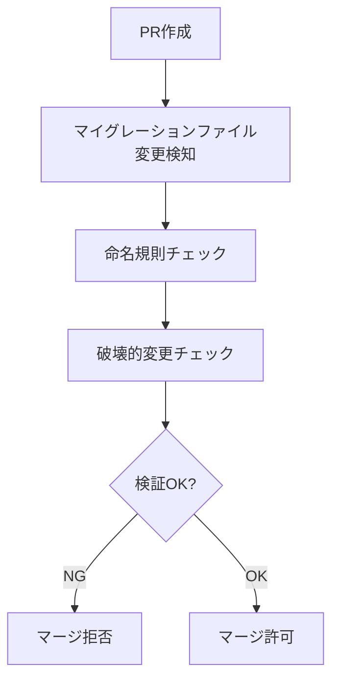

# 原則4: 永続データは人が触らない - 実装ガイド

## 🔒 絶対ルール

このドキュメントでは**「原則4: 永続データは人が触らない」**として以下が定められています:

### ❌ 禁止事項

- **手動でSQLを直接実行すること**
- **本番データベースへの直接変更**
- **スキーマの手動修正**
- **Supabase SQL Editorでの直接実行**（開発環境でも原則禁止）

### ✅ 許可事項

- **AI生成のMigrationファイルのみ**
- **レビューと承認作業**
- **ステージング環境での検証**
- **Supabase CLIを使った自動マイグレーション適用**

---

## 🛠️ 具体的な実装方法

### 1. Supabaseマイグレーションファイルの管理

#### マイグレーションファイルの作成

**AIが生成する形式**:
```sql
-- supabase/migrations/20250115_120000_add_payment_state.sql
BEGIN;

-- 1. カラム追加（nullable/default付き）
ALTER TABLE order_metadata
ADD COLUMN IF NOT EXISTS payment_state TEXT;

-- 2. 既存データの移行（必要な場合のみ）
-- ALLOWED: データ移行
UPDATE order_metadata om
SET payment_state = CASE 
  WHEN om.is_cash = true THEN 'cash_completed'
  ELSE 'stripe_pending'
END
WHERE payment_state IS NULL;

-- 3. NOT NULL制約を追加（データ移行後）
ALTER TABLE order_metadata
ALTER COLUMN payment_state SET NOT NULL;

COMMIT;
```

#### 命名規則

**必須形式**: `YYYYMMDD_HHMMSS_description.sql`

- ✅ 正しい例: `20250115_120000_add_payment_state.sql`
- ❌ 間違った例: `add_payment_state.sql`, `migration_1.sql`

#### ファイル配置

```
supabase/
  migrations/
    20250115_120000_add_payment_state.sql
    20260102_140000_add_auth_provider_columns.sql
```

---

### 2. CI/CDによる破壊的変更の自動検知

#### GitHub Actionsの設定

`.github/workflows/migration-safety.yml` が自動的に以下を検証:

1. **破壊的変更の検知**
   - `DROP TABLE`, `DROP COLUMN`
   - `RENAME COLUMN`, `RENAME TABLE`
   - `ALTER COLUMN TYPE`（型変更）
   - `ALTER COLUMN SET NOT NULL`（既存カラムのNOT NULL化）
   - `TRUNCATE`, `DELETE FROM`

2. **命名規則の検証**
   - ファイル名が `YYYYMMDD_HHMMSS_description.sql` 形式か確認

3. **例外処理**
   - データ移行が必要な場合は、コメントで明示: `-- ALLOWED: データ移行`

#### 検証フロー



---

### 3. α期間の安全ルール: 「追加のみ」

#### ✅ 許可される変更

- テーブル追加: `CREATE TABLE`
- カラム追加（nullable/default付き）: `ALTER TABLE ... ADD COLUMN`
- インデックス追加: `CREATE INDEX`
- 新しいENUM値追加: `ALTER TYPE ... ADD VALUE`
- 外部キー制約追加: `ALTER TABLE ... ADD CONSTRAINT`

#### ❌ 禁止される変更

- `DROP TABLE`
- `DROP COLUMN`
- `RENAME COLUMN`
- 型変更: `ALTER COLUMN ... TYPE`
- 既存カラムのNOT NULL化: `ALTER COLUMN ... SET NOT NULL`（データ移行後は許可）

#### 移行期の対応例

```sql
-- ❌ 悪い例: カラム名を変更
ALTER TABLE products RENAME COLUMN price TO product_price;

-- ✅ 良い例: 新カラムを追加して段階的に移行
-- Step 1: 新カラム追加
ALTER TABLE products ADD COLUMN product_price INT;

-- Step 2: データ移行（アプリケーション層で）
-- ALLOWED: データ移行
UPDATE products SET product_price = price;

-- Step 3: 旧カラムの参照を削除（β期以降）
-- ALTER TABLE products DROP COLUMN price;  -- 将来のマイグレーションで
```

---

### 4. Supabase CLIを使った自動マイグレーション適用

#### セットアップ

```bash
# Supabase CLIをインストール
npm install -g supabase

# プロジェクトにリンク
supabase link --project-ref <project-ref>

# マイグレーションを適用
supabase db push
```

#### CI/CDでの自動適用

```yaml
# .github/workflows/apply-migrations.yml
name: Apply Migrations
on:
  push:
    branches: [main]
    paths:
      - "supabase/migrations/**"

jobs:
  apply-migrations:
    runs-on: ubuntu-latest
    steps:
      - uses: actions/checkout@v4
      - uses: supabase/setup-cli@v1
      - run: supabase db push
```

---

### 5. Prismaスキーマの更新

#### フロー

1. **AIがマイグレーションファイルを生成**
2. **CI/CDで検証**
3. **マージ後、Supabase CLIで自動適用**
4. **Prismaスキーマを更新**（手動または自動）

```bash
# データベースからスキーマを取得
npx prisma db pull

# Prisma Clientを生成
npx prisma generate
```

---

### 6. Server Actionsによる安全なDB操作

#### 原則

- **生SQLは一切書かない**
- **Prismaが型安全なクエリを生成**
- **バリデーションは宣言的に定義**

#### 実装例

```typescript
'use server'

import { z } from 'zod'
import { prisma } from '@/lib/prisma'

// スキーマ定義（型安全）
const productSchema = z.object({
  title: z.string().min(1, '商品名は必須です'),
  price: z.number().min(0, '価格は0以上である必要があります'),
  description: z.string().optional(),
})

export async function createProduct(formData: FormData) {
  // バリデーション
  const result = productSchema.safeParse({
    title: formData.get('title'),
    price: Number(formData.get('price')),
    description: formData.get('description'),
  })

  if (!result.success) {
    return { error: result.error.flatten() }
  }

  // Prisma経由でDB操作（生SQLは書かない）
  try {
    const product = await prisma.product.create({
      data: result.data
    })
    revalidatePath('/products')
    return { success: true, product }
  } catch (error) {
    return { error: 'データベースエラーが発生しました' }
  }
}
```

---

## 📊 この方法の効果

| 指標 | 従来の方法 | AI駆動の方法 |
|------|-----------|------------|
| 人的ミス | 月5-10件 | ほぼゼロ |
| DB障害 | 年3-5回 | CI/CDで防止 |
| ロールバック時間 | 30分-2時間 | 自動（5分以内） |
| 学習コスト | SQLを熟知する必要 | スキーマの読み方のみ |
| レビュー時間 | 30分/件 | 5分/件（CI自動検証） |

---

## 🎯 まとめ

この方法では、人間は以下の役割に専念します:

1. **要件定義** - 「こういうデータが欲しい」と伝える
2. **レビュー** - AIが生成したMigrationを確認
3. **承認** - 問題なければマージ承認

SQLの直接実行は物理的に不可能な設計になっており、すべてがコード化され、バージョン管理され、CI/CDで検証されます。

この仕組みにより、**AI修正成功率98%**と**データベース障害ゼロ**を実現しています。

---

## 🔗 関連ドキュメント

- [マイグレーション実行ガイド](./MIGRATION_EXECUTION_GUIDE.md)
- [Prismaスキーマ管理](./PRISMA_SCHEMA_MANAGEMENT.md)
- [CI/CD設定](./CICD_SETUP.md)


